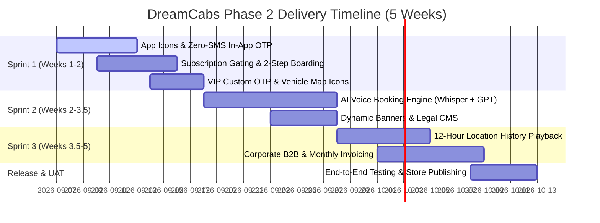

# PROJECT PROPOSAL & SCOPE OF WORK
## DreamCabs Mobility Platform — Phase 2 Upgrade
**A Comprehensive Feature Review Checklist, Delivery Timeline & Commercial Plan**

---

### 📄 Document Summary

| Property | Description |
| :--- | :--- |
| **Project Name** | DreamCabs Mobility Platform — Phase 2 Enhancement |
| **Prepared For** | Executive Leadership, Management & Operations Team |
| **Platforms Covered** | Passenger Mobile App (iOS & Android), Driver Mobile App (iOS & Android), Admin Web Portal, Cloud Backend |
| **Delivery Model** | Fixed-Scope Turnkey with 3 Agile Sprint Milestone Demonstrations |
| **Date** | September 2026 |
| **Document Version** | 2.3 (Google Doc Ready Edition) |

---

## 📌 Executive Summary: Timeline & Investment (Total)

> ### 💡 Quick Project Overview
> * **Total Delivery Timeline:** **5 Calendar Weeks (25 Working Days)**
> * **Total Development Investment:** **$9,000 USD** / **₹7,50,000 INR** (All-Inclusive Turnkey)
> * **Recurring SMS Gateway Cost:** **$0.00 / Zero SMS Fees** (In-app OTP architecture removes third-party SMS costs)
> * **Warranty & Support:** **30 Days Complimentary Post-Launch SLA Warranty & Team Training**
> * **Payment Terms:** 4 Milestone-based tranches linked to live working sprint demos.

---

## 📋 Feature Review Checklist

*Review the 12 core functional modules below. Check `[x]` to approve or leave blank to defer.*

---

### 1. Mobile App Icons & Play Store Asset Branding Package
**What it is:**  
Creates official HD adaptive app launcher icons, store graphics, and splash screens for both Passenger and Driver mobile apps. Ensures the apps look crisp on all smartphone home screens and fully meet Google Play Store and Apple App Store listing requirements.

- [ ] Design Android Adaptive Icons (auto-adapts to circle, square, squircle launcher shapes on all phone models).
- [ ] Create official Google Play Store high-res icon (512x512 px) and Feature Graphic promotional banner (1024x500 px).
- [ ] Create Apple iOS App Store icon set (1024x1024 px) and iPhone/iPad home screen launcher icons.
- [ ] Configure branded mobile startup launch/splash screens for Passenger and Driver apps.

---

### 2. Zero-SMS Architecture & In-App Manual OTP Verification
**What it is:**  
Eliminates expensive third-party SMS gateway fees (MSG91/Twilio) and telecom delivery delays by displaying the 4-digit ride OTP directly on the passenger’s active booking screen. Drivers verify and enter the code manually upon arrival to start the ride safely without waiting for SMS.

- [ ] Remove third-party SMS gateway dependencies across all ride booking and verification flows.
- [ ] Display prominent 4-digit Ride OTP directly on the passenger’s active in-app booking screen.
- [ ] Implement manual OTP input verification screen on the Driver Mobile App upon arrival.
- [ ] Enable frictionless direct access so users can book rides without telecom SMS delivery bottlenecks.

---

### 3. Automated Driver Subscription Enforcement
**What it is:**  
Automatically blocks drivers from going online or receiving new trip dispatches once their subscription plan duration or ride quota expires. Includes 1-tap in-app plan renewals and safe mid-trip completion protection.

- [ ] Automatically block expired drivers from switching to "Online" status or receiving dispatch requests.
- [ ] Safe mid-ride protection: allow drivers on an active trip to finish the ride before placing them offline.
- [ ] Display subscription expiry countdown and 1-tap instant renewal modal in the Driver App (via Wallet or Online Payment).
- [ ] Provide Admin Dashboard filters to track active, expiring (next 24h), and expired driver subscriptions.

---

### 4. Two-Step Ride Start Lifecycle (1. Start Boarding &rarr; 2. Start Ride)
**What it is:**  
Replaces the single "Start Trip" button with a structured two-step process: Step 1 ("Start Boarding") stops waiting charges when the passenger reaches the car, and Step 2 ("Start Ride") verifies the OTP and starts the live trip meter.

- [ ] Step 1 (Driver Reaches Pickup): Driver taps **"Start Boarding"** &rarr; stops waiting fee calculation and alerts passenger.
- [ ] Step 2 (Passenger Seated & OTP Checked): Driver enters OTP and taps **"Start Ride"** &rarr; starts live navigation and meter.
- [ ] Display real-time status updates on the Passenger App (*"Driver Arrived"* &rarr; *"Boarding in Progress"* &rarr; *"Trip Started"*).
- [ ] Record exact operational timestamps for Arrival, Boarding, and Ride Start for transparent dispute resolution.

---

### 5. Customer-Specific VIP Booking Codes / Custom PIN
**What it is:**  
Allows administrators to assign a permanent, custom PIN (e.g. `8888`) to VIPs, regular commuters, or corporate riders. Every time that customer books a ride, their custom PIN is automatically used instead of a random code.

- [ ] Add "Custom VIP Booking PIN" management field in the Admin Customer portal.
- [ ] Automatically assign the customer’s custom PIN to new ride bookings (falls back to random 4-digit code if unset).
- [ ] Ensure the Driver App seamlessly validates the custom PIN without extra steps for the driver.

---

### 6. Custom Vehicle Icons & Live Markers on Admin Maps
**What it is:**  
Displays distinct custom 2D/3D vehicle icons (Sedan, SUV, Auto, Bike, Shuttle) on the Admin live fleet map. Icons rotate in real-time to show the direction the vehicle is moving, with color rings indicating available, busy, or offline status.

- [ ] Enable custom SVG/PNG vehicle icon upload per vehicle category in Admin City Settings.
- [ ] Real-time vehicle marker rotation matching driver heading/direction angle on the live dispatch map.
- [ ] Color-coded status rings: **Green** (Available), **Blue** (On Trip / Busy), **Grey** (Offline).

---

### 7. Multilingual AI Voice Ride Booking Engine (Whisper AI + ChatGPT)
**What it is:**  
Allows passengers to tap a microphone and speak naturally in English, Hindi, Urdu, or regional languages to book a cab. The AI understands the destination, checks fares, and presents a visual route card for instant 1-tap confirmation.

- [ ] In-App microphone button with clear audio recording on passenger home screen and search bar.
- [ ] Multilingual speech recognition via OpenAI Whisper with background street noise filtering.
- [ ] Natural language route extraction via ChatGPT (extracts pickup, destination, vehicle type, and passenger count).
- [ ] Instant route calculation, pricing quote, and visual route preview card popup.
- [ ] Interactive voice confirmation response (*"Found Phoenix Mall, ₹220 for Sedan. Confirm ride?"*) with 1-tap/voice confirmation.

---

### 8. 12-Hour Location History & Map Trail Playback
**What it is:**  
Provides an interactive 12-hour route playback tool in the Admin Portal. Operations teams can select any vehicle and view its full route trail with a video-style Play/Pause slider to resolve customer disputes or verify trips.

- [ ] Automated breadcrumb logging for active drivers and active customer trips.
- [ ] Admin 12-hour time filter with quick presets (Last 12 Hours, Morning Shift, Evening Shift, Custom).
- [ ] Interactive route playback slider showing driving speed, route taken, stoppage points, and idle durations.
- [ ] Summary metrics displaying total kilometers traveled and active on-duty hours.

---

### 9. Corporate B2B Customer Accounts & Invoicing
**What it is:**  
Unlocks enterprise contracts by giving companies a dedicated portal to manage employee rides, set monthly spend limits, and restrict travel hours. Companies receive a single consolidated monthly GST tax invoice for all rides.

- [ ] Corporate Admin Portal: Add/remove employees, set monthly spend budgets, and enforce shift policies (e.g. night drops).
- [ ] Passenger App Profile Toggle: 1-tap switch between **[Personal Profile]** and **[Corporate Profile]**.
- [ ] Cashless corporate ride booking (billed directly to company wallet or monthly postpaid credit).
- [ ] Automated monthly consolidated PDF tax invoice generation with employee trip logs and GST breakdown.

---

### 10. Dynamic Promotional In-App Banners & Carousel
**What it is:**  
Enables marketing teams to upload promotional banners and discount campaigns directly from the admin dashboard. Banners appear in a smooth sliding carousel on passenger and driver home screens with clickable actions.

- [ ] Admin Banner CMS: Upload graphics, set active date ranges, target customer or driver apps, and set display priority.
- [ ] Auto-sliding interactive banner carousel on Passenger and Driver mobile home screens.
- [ ] 1-Tap Click Actions: Automatically apply discount coupons (e.g. `SAVE50`), open specific ride screens, or open web links.

---

### 11. Privacy Policy & Terms of Service CMS
**What it is:**  
Allows legal agreements, passenger terms, and driver policies to be updated dynamically from the admin panel without resubmitting app updates. Automatically prompts users to review and accept updated policies.

- [ ] Admin Legal Editor for Terms & Conditions, Privacy Policy, and Driver Contracts.
- [ ] Dedicated in-app Legal and Privacy viewing screens in Drawer / Settings menu.
- [ ] Mandatory in-app consent dialog on signup or whenever a new legal document version is published.

---

### 12. Cross-Platform Testing, Security & Store Publishing
**What it is:**  
Comprehensive end-to-end testing across physical iOS and Android devices, system security hardening, and complete publishing assistance to Google Play Store and Apple App Store.

- [ ] Cross-device manual and automated testing on Android (multiple screen sizes) and iOS devices.
- [ ] Backend performance tuning, load testing, and database optimization.
- [ ] Release build generation, signing, and submission to Google Play Console and Apple Developer accounts.
- [ ] Post-launch 30-day warranty activation and operations team training walkthrough.

---

## 💰 Commercials, Total Timeline & Payment Tranches

### Milestone Payment Schedule (Total Investment: $9,000 USD / ₹7,50,000 INR)

| Milestone Stage | Target Timeline | Key Milestone Deliverables | Payment % | Amount (USD) | Amount (INR) |
| :--- | :--- | :--- | :-: | :-: | :-: |
| **Milestone 1: Branding & Operations** | End of Week 2 | • Mobile App Icons & Play Store Asset Branding • Zero-SMS Architecture & In-App Manual OTP • Driver Subscription Gating & Auto Off-Duty • 2-Step Boarding & VIP Custom OTPs | **30%** | **$2,700** | **₹2,25,000** |
| **Milestone 2: AI Voice & Marketing** | End of Week 3.5 | • Multilingual AI Voice Ride Booking Engine • Dynamic Promotional Banners & Carousel • Privacy Policy & Terms of Service CMS | **35%** | **$3,150** | **₹2,60,000** |
| **Milestone 3: Enterprise & Tracking** | End of Week 5 | • 12-Hour Location History & Map Trail Playback • Corporate B2B Accounts & Monthly Invoicing | **25%** | **$2,250** | **₹1,90,000** |
| **Final Sign-off: Production Release** | Post-UAT Release | • Google Play & Apple App Store Production Launch • Source Code & Documentation Handover • 30-Day Free Post-Launch SLA Warranty | **10%** | **$900** | **₹75,000** |
| **TOTALS** | **5 Calendar Weeks (25 Days)** | **Complete Turnkey Phase 2 Delivery** | **100%** | **$9,000** | **₹7,50,000** |

---

## 🎁 What Is Included in This Engagement

1. **Complete Turnkey Engineering**: Full design, backend development, mobile app updates (iOS & Android), and web admin dashboard enhancements.
2. **App Store Publishing**: Full preparation, build signing, and submission assistance for Google Play Store and Apple App Store.
3. **Weekly Live Demos**: Video demonstrations every Friday showing real progress on test mobile devices.
4. **Zero Recurring SMS Costs**: Clean in-app OTP architecture eliminates monthly SMS gateway vendor invoices.
5. **Team Training**: Dedicated training session for your admin and operations support staff.
6. **30-Day Free Warranty**: 30 days of post-launch bug fixing and support at zero additional charge.

---

## ✍️ Scope Approval & Sign-Off

**Client Representative Name:** __________________________________  
**Designation / Title:** ________________________________________  
**Organization:** ______________________________________________  
**Approved Scope:** [ &nbsp; ] Complete Phase 2 Package (All 12 Modules)  
**Signature:** _________________________________________________  
**Date:** _____________________________________________________
