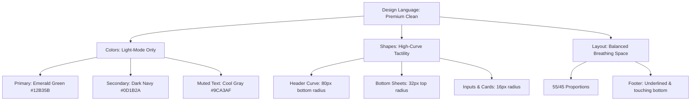

# 🔮 Project Recovery & Context Injection Document
> [!NOTE]
> This document acts as the definitive source of truth for the ride-hailing MVP. In the event of a chat reset or model transition, **inject this document first** to restore all design parameters, stack architecture, and development patterns.

---

## 🎯 1. Core Project Goal
To develop a high-performance, premium, and visually stunning ride-hailing MVP optimized for the Kashmiri region. The project encompasses four primary modules:
1. **Laravel Backend**: API server + Queue listeners + Reverb sockets.
2. **Customer Mobile Application**: High-end Ionic/Angular mobile client.
3. **Driver Mobile Application**: Matching Ionic/Angular partner client.
4. **Admin Frontend Portal**: Angular dashboard management system.

---

## 👥 2. Roles & Collaboration Model

### 👨‍💻 USER Role (Product Owner & Reviewer)
* **Action**: Provides wireframe mockups, describes layout/flow revisions, reviews screen aesthetics, and coordinates local environments.
* **Control**: Mandates style choices (e.g., light-mode locks, curvature measurements, spacing breathing buffers).

### 🤖 AGENT Role (Lead Architect & Pair Programmer)
* **Action**: Executes pixel-perfect code transformations across frontend and backend modules; proactively runs tests/compilers; audits visual assets; formats elegant codebases.
* **Aesthetic Standard**: Guarantees premium design outputs. Rejects basic/ugly MVPs.

---

## 🔄 3. Operational Workflow & Prompting

### 📥 User Prompts & Instructions
To keep the pairing tight:
* Reference specific screens using mockup names (e.g., `13_Welcome.jpg`, `14_LoginWithMobile.jpg`, `15_OTPVerification.jpg`).
* Specify structural proportions (e.g., "55% header height, 32px sheet rounding").
* Mention layout balance concerns directly (e.g., "breathing space", "align terms text to absolute bottom").

### 📤 Agent Execution & Response Rules
* **No Placeholders**: Never write placeholder lines or dummy layout blocks. Every component must be fully implemented.
* **Proactive Status Verification**: Always compile assets and monitor standard outputs before declaring a task finished.
* **Preserve Documentation**: Retain code comments, symbol declarations, and metadata logs.
* **Symbols & Links**: Reference code variables, CSS classes, and directories using absolute markdown URLs (e.g., `file:///c:/...`).

---

## 🎨 4. Design Philosophy & UI/UX Standards

The application follows the sleek, tactile look-and-feel of modern iOS/Android interfaces (e.g., Apple Maps, Uber Premium, Grab) with specialized region overrides.



### 🎨 Color Palette
| Token | HEX / Value | Role |
| :--- | :--- | :--- |
| `--ion-color-primary` | `#12B35B` (Emerald) | Primary brand green, CTA buttons, active state indicators |
| `--ion-color-secondary` | `#0D1B2A` (Dark Navy) | Header backgrounds, prominent typography, brand graphics |
| `--text-main` | `#1C1C1E` (Off-black) | Body text, titles, numeric input characters |
| `--text-muted` | `#9CA3AF` (Cool Gray) | Captions, instructions, placeholder labels |
| `--background-light` | `#F9FAFB` (Off-white) | Background panels, inactive modals, permissions cards |

### 📐 Spacing & Curve Geometry
* **Curved Header**: The top header graphic must cover exactly **`55vh`** (`min-height: 55vh`) and feature highly curved bottom corners (`border-bottom-left-radius: 80px; border-bottom-right-radius: 80px;`).
* **Interactive Modals**: The country list selector uses a premium slide-up iOS bottom sheet (`initialBreakpoint="0.75"`) with highly curved top corners (`--border-radius: 32px 32px 0 0;`).
* **Layout Breathing Buffer**: Core interactive elements (e.g., phone inputs, OTP boxes, FAB next buttons) must separate cleanly using margin scales of **`24px` to `50px`**.
* **Sticky Footers**: Legal disclaimers ("Terms & Conditions") must sit at the absolute bottom of the screen with a `24px` padding-bottom cushion. All legal links must be explicitly **underlined**.

---

## 🛠️ 5. Technical Stack & Architecture

### 💻 Mobile Client Modules (Customer & Driver)
* **Core Framework**: Ionic 8 + Angular 19+ (Standalone component environment).
* **Styling Compiler**: SCSS (structured, nested BEM layout rules).
* **Authentication**: Firebase Phone Auth (SMS OTP verification).
* **State & Routing**: Sequential route mapping matching wireframe progressions. Wildcard catchalls must remain at the bottom of the routing arrays.

### 🛡️ Core Coding Standards
* **Disable Standalone Declarations**: To prevent Angular compiler collision crashes (`NG6008`), ensure standard view pages declare `standalone: false` in their component decorators when managed via module-level routing providers.
* **Secure Shadow DOM Selection**: Overriding scrollable containers in Ionic must target the `::part(scroll)` pseudoelement directly:
  ```css
  ion-content::part(scroll) {
    /* custom scrolling code here */
  }
  ```

---

## 💾 6. Major Technical Decisions & Implementations

### 1. Light-Mode Lock
To align with MVP branding and avoid style clashes, system dark palettes were locked out globally inside [global.scss](file:///c:/Users/masud/Desktop/myProject/customer-mobile/src/global.scss) by neutralizing:
```scss
/* @import "@ionic/angular/css/palettes/dark.system.css"; */
```

### 2. Country Selector Overhaul
Transformed standard full-screen picker modals into a tactile, country list slide-up bottom sheet featuring custom country items, ISO badges (`IN`, `US`, `GB`), checkmark active states, and custom rounded headers.

### 3. Permissions Screen Remodel
Overhauled the default gray permissions disclosure to use the flagship curved header graphic and beautiful flexbox list cards:
* **HTML**: [login.page.html:L120-181](file:///c:/Users/masud/Desktop/myProject/customer-mobile/src/app/auth/login/login.page.html#L120-L181)
* **SCSS**: [login.page.scss:L458-570](file:///c:/Users/masud/Desktop/myProject/customer-mobile/src/app/auth/login/login.page.scss#L458-L570)

### 4. 4-Box Overlay OTP Field
To support responsive typing and OS-level SMS copy/paste verification without focus shifting, a single hidden HTML input spans the width of 4 custom visual boxes (`.otp-box`).
* **HTML**: [login.page.html:L183-228](file:///c:/Users/masud/Desktop/myProject/customer-mobile/src/app/auth/login/login.page.html#L183-L228)
* **SCSS**: [login.page.scss:L330-440](file:///c:/Users/masud/Desktop/myProject/customer-mobile/src/app/auth/login/login.page.scss#L330-L440)

---

## ⚡ 7. Recovery Blueprint: Instantly Resume Tasks
When initiating a new session, follow these steps:
1. Check background compilation status via ports `8100` (Customer) and `8101` (Driver).
2. Set up visual reference checks using target image resources from [Photos/photos/](file:///c:/Users/masud/Desktop/myProject/Photos/photos/).
3. Continue the onboarding/auth flow. The next phase is **Profile Completion / Information Validation (`step === 'info'`)**. Use the same curved `.auth-header` style guidelines!
